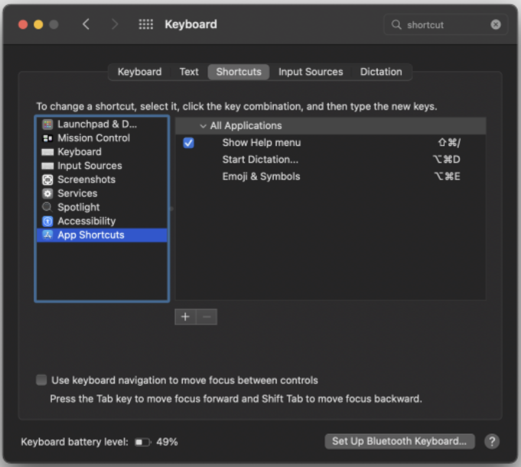
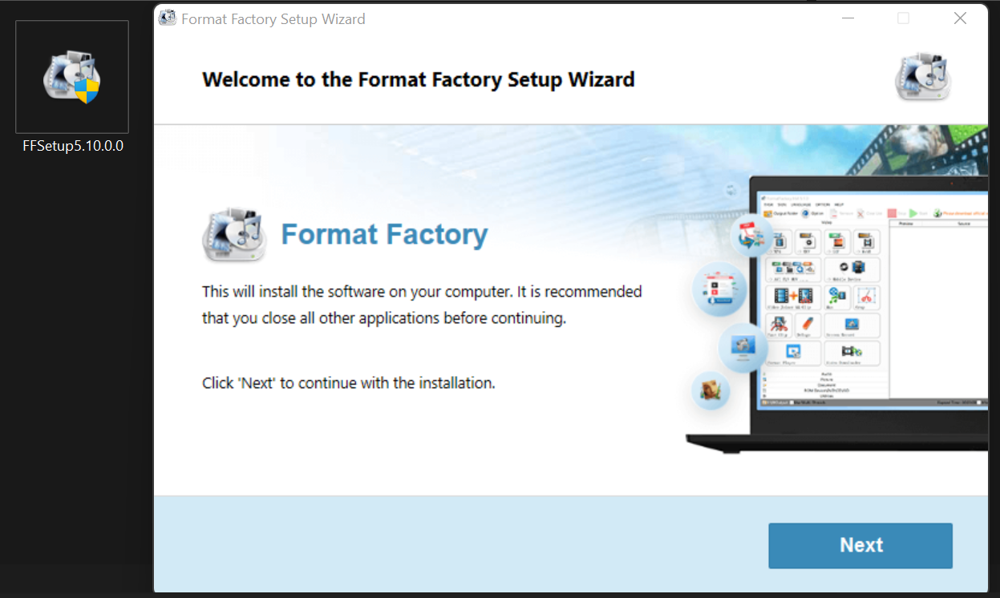
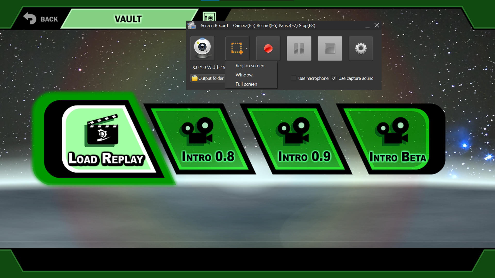
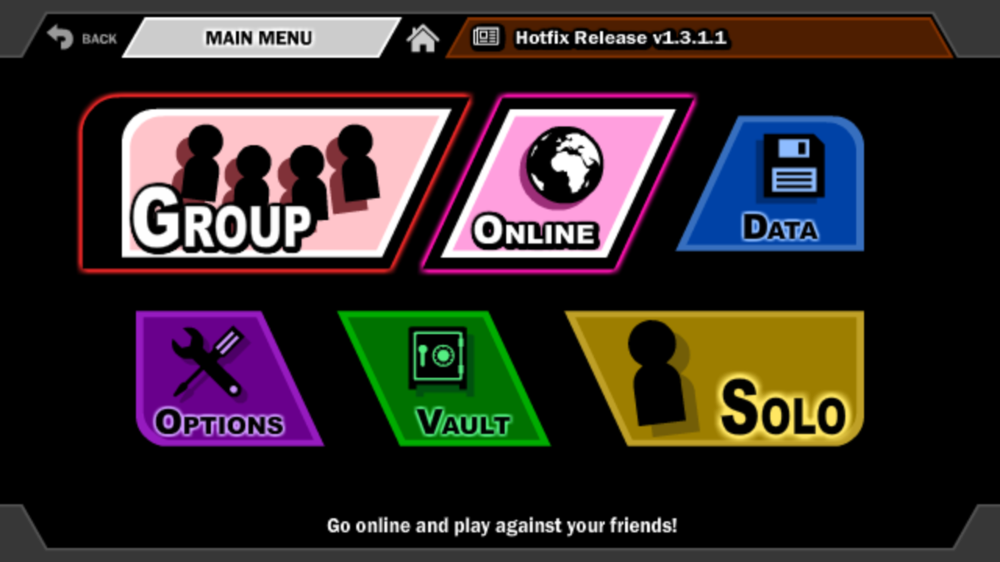

# **1\. Setup** {#1.-setup}

## ---

## 1.1 Installation {#1.1-installation}

---

### **1.1.1 Windows** {#1.1.1-windows}

Download the correct and desired version of SSF2 using a [Simple Download](#1.2.1-simple-download).

* Make sure you choose the right [bitness](https://www.hellotech.com/blog/whats-the-difference-between-32-bit-and-64-bit) version (either 32-bit or 64-bit).   
  * The version chosen must match your PC’s bitness (i.e. get 64-bit SSF2 for a 64-bit PC).  
  * If you’re unsure of whether you have a 32-bit or 64-bit PC, use [this guide](https://www.computerhope.com/issues/ch001121.htm#windows-10).  
  * Note: If you have a 64 bit PC, you can technically run 32-bit programs as well, but 64-bit programs will run better, so that’s what I’d recommend.  
* Choose whether you want the **Installer** or **Portable** version  
  * The **Installer** version is an installer executable that will install SSF2 onto your PC, adding a Start Menu folder, shortcuts, and an uninstaller et cetera. I recommend this if you can use it, for its convenience.  
  * The **Portable** version is an archive containing the game’s files. Once extracted the game can be run. No shortcuts or other items are added.  
    * It is useful if you lack administrator permissions and cannot run the installer.  
    * It is useful for keeping different versions of SSF2 on your PC simultaneously.  
      * Previous SSF2 versions can be found on the [official Archives page](https://www.supersmashflash.com/play/ssf2/downloads/archives/).

        

If you chose the **Installer** version:

1. Run the setup file (e.g. by double-clicking it in your downloads folder).  
   2. Select **Yes** when the User Account Control window appears, and follow the prompts.   
   3. Once the game is installed, you can delete the installer.  
   4. To run the game:  
      1. Use the shortcuts generated (in Desktop/Start Menu).  
      2. OR Search for “Super Smash” and choose “Super Smash Flash 2 Beta”.

If you chose the **Portable** version:

* Using File Explorer, place the archive in the folder where you want the game to reside.  
* Extract the ZIP archive with:  
  1. File Explorer, by simply right-clicking and selecting “Extract All”, as shown [here](https://www.windowscentral.com/sites/wpcentral.com/files/styles/large/public/field/image/2017/02/extract-all-zip-windows10.jpg).  
  2. OR an Archive manager (e.g. Install [7Zip](https://www.7-zip.org/), right-click and choose “Extract Here”.)  
* To run the game, find and execute the “SSF2.exe” executable within the extracted files.

If you have any issues, see the [next section](#1.1.1.1-windows-troubleshooting).

---

#### **1.1.1.1 Windows Troubleshooting** {#1.1.1.1-windows-troubleshooting}

*Issue: “During installation, I get an error like: ‘An error occurred while trying to rename a file in the destination directory:  MoveFile failed; code 5\. Access is denied.”*

Solution:

* Try installing to the default location (Program Files) instead of a location like Documents.  
* Try using the Portable version.

*Issue: “During installation, I get an error like: ‘The drive or UNC share you selected does not exist or is not accessible. Please select another.”* ([Screenshot](https://drive.google.com/file/d/1S4etEyegRbCLdYpkM7odO8LIaB-Mgi0s/view?usp=sharing)).

Solution:

* Try to ensure that the installer and install location are on the same drive.  
  * e.g. Store both on the “C:\\” Drive.  
* Try using the Portable version.

*Issue: “You get an error like: ‘This app can't run on this PC’.”*

Solution:

* Get the right bitness version of SSF2.  
* See [this part](#1.1.1-windows) of the guide for details.

*Issue: “After running SSF2, you get a popup that says: ‘Security alert: The internet site that will be shown uses a certificate that already expired or is not yet valid. Do you wish to continue?’”* ([Screenshot](https://drive.google.com/file/d/1SgkBEmm96J51FHaeIHy_M98efwyTJwN8/view?usp=sharing)).

Solution:

* This doesn’t really mean much, don’t worry.  
* Just press Yes, and you’ll be fine.

*Issue: “When I try starting the game, the screen is black.”*

Solution:

* Install the Adobe AIR Runtime after downloading at [the official site](https://airsdk.harman.com/runtime).  
* If you have any issues installing it, see the **Known Issues** section of the [same site](https://airsdk.harman.com/runtime).

*Issue: “When I try to go fullscreen, the screen goes black.”*

Solution:

* You can try pressing the “Alt” and “Enter” keys together.

* You can also try updating/reinstalling your graphics drivers.

  * It is suspected that this issue comes from the game trying to use the graphics card in full screen and the driver isn't compatible.

***Issue:** The game fails to load beyond 96% (or another number), remaining stuck on the loading screen.*

Solution: 

* Try running the game without internet.  
* This often occurs when the game encounters difficulties fetching the data required for the "News Feed" tab.

If you still have a problem, visit the **\#ssf2-general** channel in the [official McLeod Gaming server](https://discord.com/invite/mcleodgaming) to get help.

---

### **1.1.2 Mac** {#1.1.2-mac}

1. Download the only Mac version, “**Mac 64-bit (Standalone)**” using a [Simple Download](#1.2.1-simple-download).  
2. Once the ZIP file has finished downloading, double click on it to extract it.  
3. A folder with the game’s files will appear next to the ZIP file.  
4. To run the game, find and execute the SSF2 executable within the extracted files.

If you have any issues, see the [next section](#1.1.2.1-mac-troubleshooting).

---

#### **1.1.2.1 Mac Troubleshooting** {#1.1.2.1-mac-troubleshooting}

Go back to the [official download page](https://www.supersmashflash.com/play/ssf2/downloads/) and check under “*Mac users having trouble playing?*”. You shall find a list of common issues and their solutions.

The “*E or D key bringing up some other window*” is a very common issue for Mac users.

* I think it is possible to fix both of these keys.  
* This [GitHub post](https://github.com/airsdk/Adobe-Runtime-Support/issues/1323#issuecomment-961264195) helps often. Also check [this reddit post](https://www.reddit.com/r/SuperSmashFlash/comments/tkhf6p/anyone_else_has_this_problem_mac/).  
* A user said: “*I went to keyboard shortcuts and changed dictation to option-command-D and that worked for me*” (TheEntertainer\#4521).  
  * An image of this is shown below.

  * 

* Another user reported that: *“The fix for this issue only started working once I put SSF2 into my Application folder. It didn't work when I was running the game from the Downloads folder.”* (angel818273737)  
  * This may be because the fix in the [GitHub post](https://github.com/airsdk/Adobe-Runtime-Support/issues/1323#issuecomment-961264195) mentions that it applies for “All Applications”, and Macs only classify programs as that once they are in the folder.

If you still have a problem, visit the **\#ssf2-general** channel in the [official McLeod Gaming server](https://discord.com/invite/mcleodgaming) to get help.

### 

### ---

### **1.1.3 Linux** {#1.1.3-linux}

---

#### **Important Note** {#important-note}

* I have written a **Bash script** to simplify and automate the Linux SSF2 installation process\!  
  * See here: [Davo's GitHub \- SSF2 Resources](https://github.com/DavoDC/SSF2_Resources)  
  * This is by far the easiest and fastest way to get SSF2 on Linux\!  
* I have also recorded a **video demonstration** of the steps outlined in this section.  
  * [How to Install SSF2 on Linux/Chromebook (Native + Wine) - by Davo](https://youtu.be/vHMe8zDKM9A)

* You may be interested in joining the [Linux SSF2 Community](https://discord.gg/UXAHEzDJPe).

---

#### **1.1.3.1 Choosing Between the Native and Wine Versions** {#1.1.3.1-choosing-between-the-native-and-wine-versions}

Linux users must first decide whether they want the [Native](#1.1.3.2-native-linux-installation) or [Wine](#1.1.3.3-wine-linux-installation) installation of SSF2. Below is a comparison of each to help you. I personally prefer the **Wine** version for its increased performance and fullscreen mode.

| Aspect | The Native Version | The Wine Version |
| ----- | ----- | ----- |
| *Input Modes* | Keyboard only, directly.  Controller possible with extra software. | Keyboard and controller directly. (e.g. Xbox One Controller) |
| *Fullscreen Mode (Enter using **Ctrl+F**)* | The controls stop working when you go fully fullscreen, but you can make the window fit the screen. | Works normally. You can go fully fullscreen. |
| *Ease of Execution* | More difficult since you must open a terminal where SSF2 is located each time you wish to run it. Note: Can be made easier with a .bashrc function that lets you start it from the default terminal. | **Installer:** Much easier since SSF2 will be added to your list of applications in your OS’s interface. You can simply search this each time or add SSF2 as a favourite for easier access. **Portable:** Same as Native |
| *Performance and Online Stability* | A bit worse | Better. Feels a bit faster/smoother. |
| *Setup Time* | Very fast since no installation is required, just an extraction. | **Installer:** Slower since you must wait for the installer to run.**Portable:** Same as Native. |
| *Visual Appearance* | Looks a bit worse on lowest settings. Some visual glitches occur in the results screen only. | Looks decent on lowest settings, better than real Windows on lowest settings. No visual glitches. |
| *Replay Autosave Feature* | No, unavailable. | Yes, available and working. |

**Notes:** 

* There is a third alternative built on top of Wine called [Lutris](https://lutris.net/games/super-smash-flash-2/). This version would likely have the properties of the Wine version but would likely require more setting up in comparison. If you know how to use it, please let me know.  
* My instructions were developed/tested on Ubuntu, but the instructions should be near-identical and still work for other distros. Modify commands as necessary (e.g. install commands need to be changed to match your package manager).

---

#### **1.1.3.2 Native Linux Installation** {#1.1.3.2-native-linux-installation}

0. Here is a [timestamped video link](https://www.youtube.com/watch?v=vHMe8zDKM9A&t=87s) to a demonstration of how to do the steps below.

   * I also have written a script to do everything for you. See the [Important Note](#important-note).

1. Download the Mirror Linux version [using your terminal](#1.2.2-terminal-download).  
2. Using the same terminal from Step 1, extract the TAR archive using the “tar” command  
   * tar \-xf SSF2BetaLinux.\*.tar \--one-top-level  
   * This uses a wildcard to match to any version of the game.  
   * If you do not have this command, install with: sudo apt-get install tar \-y (on Ubuntu/Debian distros. If on a different distro, modify this command as needed)  
3. Enter the folder created using: cd SSF2BetaLinux.\*/  
4. Enable and run the fix script with the command below:  
   * chmod u+x trust-ssf2.sh && ./trust-ssf2.sh  
   * If you wish to know more about this script of mine, [see the details here](https://github.com/DavoDC/SSF2_Resources).  
5. Run the game using “./SSF2”, which will execute the SSF2 executable.  
   * Remember this step, as you’ll need it each time you want to play.  
   * If you want to make it easier to start the game, and start SSF2 from any terminal, just by typing “ssf2” and pressing enter, you could add a function to your [bashrc file](https://www.journaldev.com/41479/bashrc-file-in-linux) similar to the one below. It simply enters your installation directory (change as needed), and then executes SSF2. See [this part of my video](https://www.youtube.com/watch?v=vHMe8zDKM9A&t=570s) for a demonstration of this.

     function ssf2 {

             cd \~/Downloads/SSF2\_Folder

             ./SSF2

     }

If you have any issues, see the [Linux troubleshooting section](#1.1.3.6-linux-troubleshooting).

---

#### **1.1.3.3 Wine Linux Installation** {#1.1.3.3-wine-linux-installation}

To simplify the wine installation you can use Bottles by following [this guide](https://gist.github.com/shifterbit/4ef642071d8a5a2029878b54c14c6197). It is particularly recommended if you’re on Steam Deck or unfamiliar with using the terminal. 

0. Here is a [timestamped video link](https://www.youtube.com/watch?v=vHMe8zDKM9A&t=710s) to a demonstration of how to do the steps below.

   * I also have written a script to do everything for you. See the [Important Note](#important-note).

1. Open a [default terminal](https://www.howtogeek.com/686955/how-to-launch-a-terminal-window-on-ubuntu-linux/) and execute the following commands:

   * sudo dpkg \--add-architecture i386  
     * Enables 32-bit packages.

     * Note: It is normal for no output to be generated after this command.

   * sudo apt update  
     * Updates package lists with new 32 bit packages.  
   * sudo apt install wine wine32 winbind \-y  
     * Installs wine and wine32.

2. Download the **Windows 32-bit** Installer or Portable version [using your terminal](#1.2.2-terminal-download).

   * To choose between the Installer or Portable version, see [this part of the guide](#bookmark=id.q4huns6yqoq5) for details.

3. If you chose the **Installer** version:

   * To install the game:  
     * Simply provide the installer as an argument to the “wine” command  
       * wine SSF2BetaSetup.32bit.\*.exe  
       * This uses a wildcard so it can match any version.  
     * An installer window will appear. Follow the prompts.

   * To run the game:

     * Press your Windows key to search then type “Super”. SSF2 should come up as it is now in your list of applications. Just click on it to start the game.

     * You can also right-click on the app after finding it in search and add it to favourites for easier future access.

4. If you chose the **Portable** version:

   * Extract the zip archive into a folder with this command:

     * unzip SSF2BetaWindows.32bit.\*.portable.zip

     * This command contains a wildcard so it can match any version.

     * If you do not have this command, install with: sudo apt-get install unzip \-y (on Ubuntu/Debian distros. If on a different distro, modify this command as needed)

   * To run the game, go into the folder, and pass the executable name to “wine”  
     * cd SSF2BetaWindows.32bit.\*.portable  
     * wine SSF2.exe  
   * To make it easier to start the game regularly, you can do [something like this](#bookmark=id.vms255bz7xnq), except the 2nd line will be different. See [this part of my video](https://www.youtube.com/watch?v=vHMe8zDKM9A&t=1213s).

If you have any issues, see the [Linux troubleshooting section](#1.1.3.6-linux-troubleshooting).

---

#### **1.1.3.4 Chromebook Linux Installation** {#1.1.3.4-chromebook-linux-installation}

1. Enable Linux Beta using the [official instructions here](https://support.google.com/chromebook/answer/9145439?hl=en) or [this video](https://youtu.be/kdCroOoYHYc).  
2. Open the Terminal App using [this article](https://helpdeskgeek.com/how-to/how-to-open-the-linux-terminal-on-chromebook/).  
3. Install a library needed for SSF2 using the command: 	  
   * sudo apt install libnss3 \-y  
4. You can **optionally** [enable these flags](https://chromeos.dev/en/productivity/experimental-features#experimental-feature-flags) to get better performance.  
   * chrome://flags/\#crostini-gpu-support  
   * chrome://flags\#scheduler-configuration  
5. You can now use the Linux instructions in the [Linux](#1.1.3-linux) section.

   * i.e. You need to choose the [Native](#1.1.3.2-native-linux-installation) or [Wine](#1.1.3.3-wine-linux-installation) installation of SSF2.

   * I have written a Bash script to help with this. See the [Important Note](#important-note).

   * By the way, even though [my Linux video](https://www.youtube.com/watch?v=vHMe8zDKM9A) is done on Ubuntu Linux, the steps are practically identical after enabling Linux on Chromebook\!

If you have any issues, see the [Linux troubleshooting section](#1.1.3.6-linux-troubleshooting).

---

#### **1.1.3.5 Flatpak Linux Installation** {#1.1.3.5-flatpak-linux-installation}

This guide by Tekacity describes how to install SSF2 on Linux using Flatpak/Bottles/Flatseal. Since a flatpak works exactly the same across every distro, this alternative method is useful for those having distro-specific issues with the other methods.

This guide should work for desktop linux and Steam Deck users, and possibly ChromeOS/Chromebook.

[Installing Super Smash Flash 2 on Linux/Steam Deck](https://gist.github.com/shifterbit/4ef642071d8a5a2029878b54c14c6197) (via Flatpak).

---

#### **1.1.3.6 Linux Troubleshooting** {#1.1.3.6-linux-troubleshooting}

***Issue:** The game doesn’t load beyond 5%, it gets stuck on the loading screen.*

Solution: You need to run the ["Trust SSF2” script](#bookmark=id.2wzwgzn5bens)**.**

***Issue:** The game is crashing.*

Solution: Set your [graphics to lowest](#2.3.2-quality/graphics-settings), or try using the [Wine version](#1.1.3.3-wine-linux-installation).

***Issue:** I’m on Chromebook and used the Wine Installer, but I can’t find the application shortcut.*

Solution: 

* The shortcut may be near the Terminal app as shown below:

  * 

* If the launcher stops working, check out [this article](https://beebom.com/how-use-windows-10-apps-chromebook-using-wine/#shortcut).   
* Alternatively:  
  * Go into the directory where the Wine Installer version is installed:

    * cd "/home/$USER/.wine/drive\_c/Program Files/Super Smash Flash 2 Beta"

  * Run “wine SSF2.exe” there.

***Issue:** When I start the Native version, it opens and works, but I get the error(s):*

* *“Gtk-Message: 16:36:10.702: Failed to load module "canberra-gtk-module”*  
* *“Failed to open VDPAU backend libvdpau\_va\_gl.so: cannot open shared object file: No such file or directory”*

Solution: 

* These are harmless errors, don’t worry, the game will still run normally.  
* The first error can be removed by doing:  
  * sudo apt-get install libcanberra-gtk-module \-y  
* The second error is related to Nvidia but doesn’t seem to be fixable.

***Issue:** When I start the Wine portable version, it opens and works, but I get the errors:*

* *“0009:err:winediag:SECUR32\_initNTLMSP ntlm\_auth was not found or is outdated. Make sure that ntlm\_auth \>= 3.0.25 is in your path. Usually, you can find it in the winbind package of your distribution.”*

* *“wine: Read access denied for device L"\\\\??\\\\Z:\\\\", FS volume label and serial are not available.”*

Solution: 

* These are harmless errors, don’t worry, the game will still run normally.  
* If you wish to remove the first, simply do:   
  * sudo apt install winbind \-y  
* If you wish to remove the second, you can start the game with this instead:  
  * sudo wine SSF2.exe  
  * Beware, this will cause your SSF2 sound to stop working.  
  * I had to apply [this fix](https://dev.to/setevoy/linux-alsa-lib-pcmdmixc1108sndpcmdmixopen-unable-to-open-slave-38on) to get sound working with this sudo method.

***Issue:** Everything is working except for my SSF2 audio/sounds.* 

* *This issue is often associated with the “ALSA Slave” errors below:*  
* *“ALSA lib pcm\_dmix.c:1089:(snd\_pcm\_dmix\_open) unable to open slave”*  
* *“ALSA lib pcm\_dsnoop.c:641:(snd\_pcm\_dsnoop\_open) unable to open slave”*

Solution: 

* This [article](https://dev.to/setevoy/linux-alsa-lib-pcmdmixc1108sndpcmdmixopen-unable-to-open-slave-38on) fixed the problem for me, and I could even run the game with sudo and have working sound.  
  * Check audio-devices and drivers: lspci \-knn|grep \-iA2 audio  
    * Output can contain lines like: *Kernel driver in use: snd\\\_hda\\\_intel*  
    * Use kernel/driver module name in next step.  
  * Create /etc/modprobe.d/default.conf with contents *like* options snd\_hda\_intel index=1 (needs to be customised for different audio devices/drivers).  
* If you are running the game as the root user, try running it as a normal one, and vice versa.  
  * i.e. Try running the game with and without ‘sudo’.  
* If you are on the Native version, try switching to the Wine version, and vice versa.  
* Sometimes another program is taking up the ALSA audio, so to fix SSF2’s audio, close all other programs generating audio.  
* This page may help: [PulseAudio \- ArchWiki](https://wiki.archlinux.org/title/PulseAudio#ALSA).  
* Try upgrading your OS/kernel.

***Issue:** “Sometimes when playing online, I get stuck at ‘Please wait’ and my opponent and I have to restart”*

Solution:

* If you are on the Native version, try switching to the Wine version.  
* It may work better if the Linux user is always the host.  
* If the Linux user goes to character select before the Windows user, the Linux user may be unable to reconnect.

***Issue:** I’m on a Chromebook and I got the error: ‘./data/fp64: error while loading shared libraries: libnss3.so: cannot open shared object file: No such file or directory’.* 

Solution: Install the missing library using ‘sudo apt install libnss3 \-y’.

***Issue:** I’m on Manjaro Linux and I got the error: ‘./data/fp64: error while loading shared libraries: libgtk-x11-2.0.so.0: cannot open shared object file: No such file or directory’.* 

Solution: 

* Install the missing library using ‘sudo pacman \-Syyu gtk2 lib32-gtk2’.   
* If using a different package manager, modify this command as needed.

***Issue:** I’m using the Native version and I got the error ‘./data/fp: error while loading shared libraries: libXt.so.6: cannot open shared object file: No such file or directory’.*

Solution: 

* Install the missing library using: ‘sudo apt install libxt6:i386 libxtst6 libxt6’.  
* If using a different package manager, modify this command as needed.

If you still have a problem, visit the **\#linux-ssf2** channel in the [Linux SSF2 Community](https://discord.gg/UXAHEzDJPe) to get help.

---

## 1.2 Download {#1.2-download}

---

### **1.2.1 Simple Download** {#1.2.1-simple-download}

*Note: Applies best to Windows and Mac users. Not recommended for Linux/Chromebook.*

1. Visit the [official download site for SSF2](https://www.supersmashflash.com/play/ssf2/downloads/) in your desired browser.  
2. Choose whether you want the **MEGA** or **Mirror** download. Both have the same data, but:  
   * The **MEGA** version, hosted by MEGA Ltd:  
     1. Requires you to use MEGA’s browser app (which can take a while to load).  
     2. Requires you to keep your tab/browser open.  
   * The **Mirror** version is like a direct, normal download. I personally recommend this as:  
     1. It starts downloading instantly, and is just as fast.  
     2. The download occurs in the background of your browser.  
     3. It allows for the use of a download manager (e.g. [Free Download Manager](https://www.freedownloadmanager.org/)) to accelerate/pause/resume your download.  
3. Proceed back to the installation steps that led you to this section.  
   * **Note**: This will likely be the [Windows](#1.1.1-windows) or [Mac](#1.1.2-mac) installation section.

---

### **1.2.2 Terminal Download** {#1.2.2-terminal-download}

*Note: Applies best to Linux or Chromebook users. Not recommended on Windows or Mac.*

1. Get the direct download URL.  
   * Go to the [official download page](https://www.supersmashflash.com/play/ssf2/downloads/) and find the **Mirror** direct download links.   
     * *This process will not work with the MEGA versions\!*  
   * Right-click on the **desired/correct** **Mirror** version and select “**Copy link address**”, as shown below:  
     *   
     * **Note:** The image is just an **example**. Your install process will likely involve right-clicking a **different version\!**

       

2. Open a terminal in the directory you wish to download your SSF2 file to.  
   * **Method 1 \- Recommended:** Find the folder in your [GUI](https://en.wikipedia.org/wiki/Graphical_user_interface)’s File Manager, right-click, and select “Open in Terminal”. See the image below from Ubuntu. This may not be available in certain distros or Chromebooks.  
     *   
   * **Method 2 \- Alternative:** Open a default terminal and keep using the “cd”, “ls” and “pwd” commands until you are in the right directory. See [here](https://www.digitalocean.com/community/tutorials/how-to-use-cd-pwd-and-ls-to-explore-the-file-system-on-a-linux-server) for details.

3. In the terminal you opened, type  “wget”, space, and then paste in the link you copied  
   * Sometimes you need to paste with right-click if Ctrl \+ V does not work.  
   * Example usage:  
   * wget https://cdn.supersmashflash.com/ssf2/downloads/**xxxxxx/SSF2.vX.X.X.X.xxx**  
     * *Note: **Do not use the example command as is**. Be sure to substitute in an up-to-date link with the version you want, as shown in Step 1\.*  
   * If “wget” is not found, install with: sudo apt-get install wget \-y (for Ubuntu/Debian distros. If you are on a different distro, see [here](https://trendoceans.com/how-to-install-wget-in-all-major-linux-distribution/))

4. Your SSF2 file is now being downloaded to your present working directory.   
   * Leave the terminal open, it will [hang](https://www.oreilly.com/library/view/learning-unix-for/0596004702/ch01s04.html), but this is normal.  
   * Wait for the download to finish before proceeding to the next step.  
   * **Keep the terminal open** after it finishes, as you will need a terminal whose working directory contains the downloaded file for the installation/execution steps.  
   * Proceed back to the installation steps that led you to this section.  
     * **Note**: This will likely be one of the installation sections in the [Linux section](#1.1.3-linux).

---

## 1.3 Updating {#1.3-updating}

---

* On all operating systems, simply repeat the download and installation process with the new version. You can overwrite the existing version, installing the new one “on top” of the old one.   
* You shouldn’t need to uninstall the old version or delete it.   
* Your user data (settings, events, records, unlocks) should transfer over.   
* The “auto-updater” that was used in older SSF2 versions no longer exists.

---
