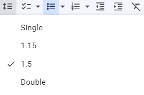
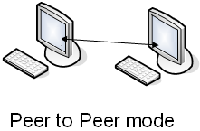
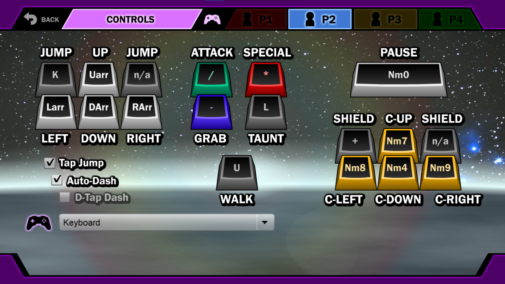
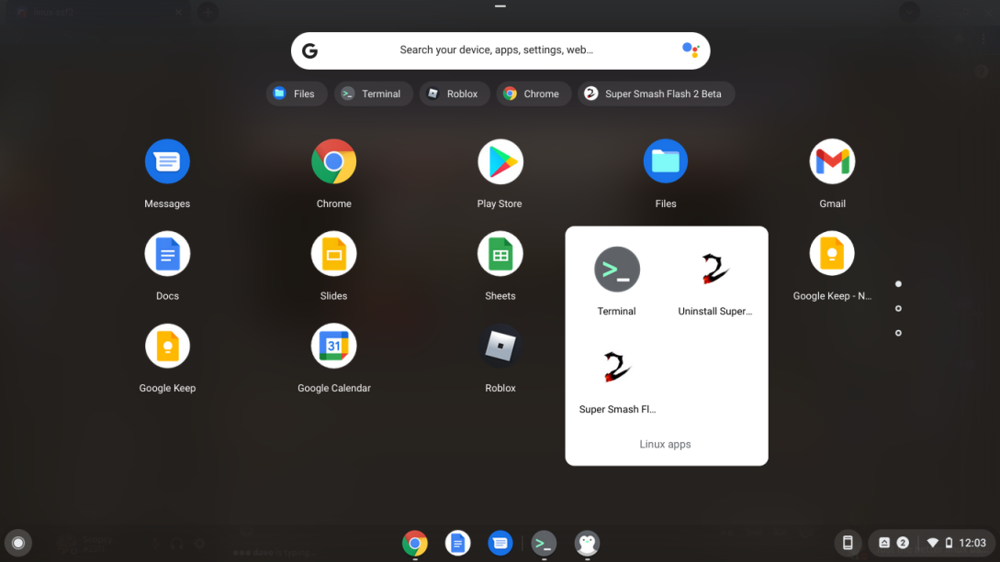
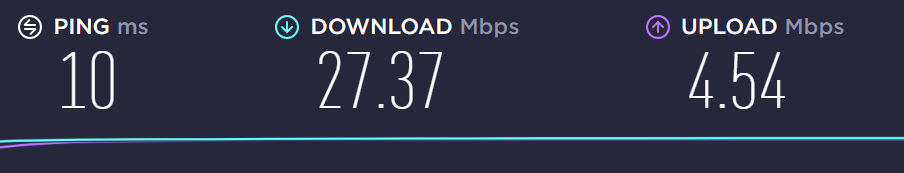
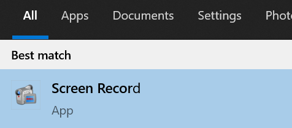
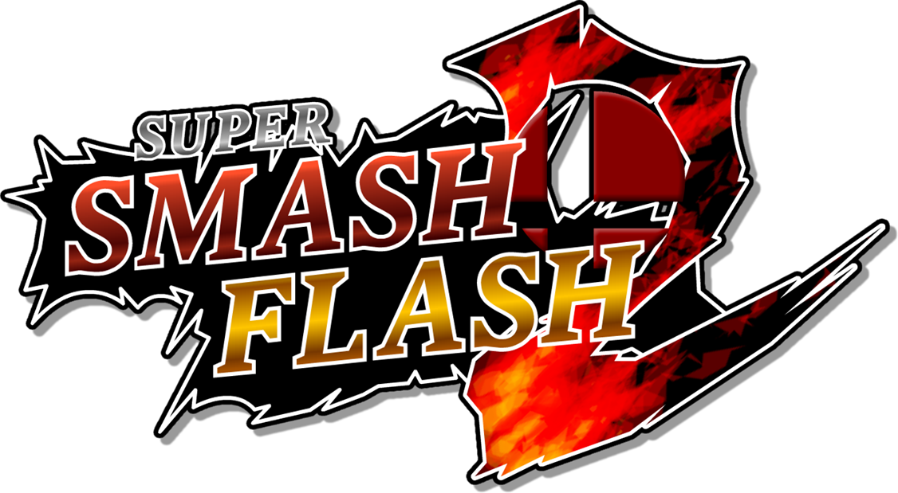
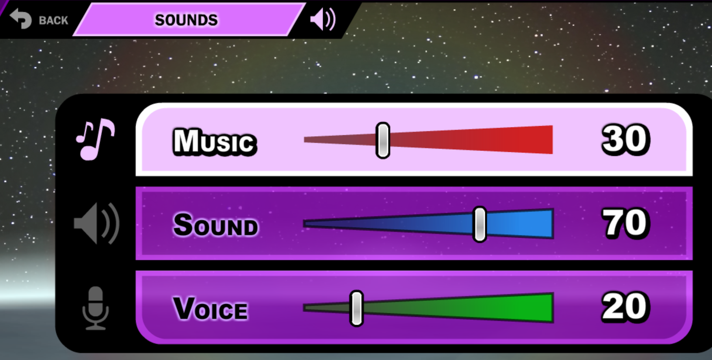

# **2\. Configuration** {#2.-configuration}

---

## 2.1 Keyboard {#2.1-keyboard}

---

I recommend using the keyboard controls, as most players do. Using a keyboard has some benefits and advantages. See [this article](https://medium.com/@smashflashbackroom/so-you-want-to-play-ssf2-how-to-control-the-game-with-a-keyboard-dc2935567c7b) for details.

If you are playing with your opponent locally on keyboard, you may want to try the 2 keyboard mod so both players can use the full keyboard. It can be found at the [creator’s Discord server](https://discord.com/invite/dcn3sn6CxC) (Peceful Pro).

---

## 2.2 Controllers

---

 {#2.2-controllers}

### **2.2.1 Controllers on Linux** {#2.2.1-controllers-on-linux}

You will need to use the Wine version of SSF2 to recognize controllers directly on Linux. See [this part of the guide](#1.1.3.3-wine-linux-installation). Alternatively, you can try getting a keymapper program to use controllers. This one has been reported to work well: [SC Controller](https://github.com/kozec/sc-controller) (Thx PseudoDistant\#4597).

---

### **2.2.2 Controllers on Windows** {#2.2.2-controllers-on-windows}

To set up controllers on Windows, I recommend Artmagic’s Controller Video: [How to Properly Set Up Controllers in SSF2](https://www.youtube.com/watch?v=ts9LSncRKrs).

To set up a Wii U GCN Adapter on Windows, use this: [Wii U GCN USB Driver](http://m4sv.com/page/wii-u-gcn-usb-driver)

To set up a PS4 controller on Windows, use [DS4Windows](https://ds4-windows.com/) \- for more details, see [this guide](https://windowsreport.com/ps4-controller-windows-10/).

To set up a GameCube controller on Windows:

* **Recommended:** Use a Mayflash adapter, or at least something with a Switch/PC toggle on the back of it, switch it to PC mode, plug in your adapter and controller, then start the game.  
* **Alternative:** Use the Official Nintendo GameCube Adapter and [Joy2Key](https://joytokey.net/en/) if you really want to use the official adapter.

To set up a Switch Pro controller on Windows:

* First, connect it to your PC like you would normally, likely through Bluetooth.  
* It *should* just work but follow the steps below if it doesn’t seem to be working correctly  
  * **Note:** A common reason why it may not be seen by the game is opening the game *\*before\** connecting the controller or having steam/dolphin (or any other program that uses your controller) open.  
* Press the Windows Key and R, and type “joy.cpl”. Then press OK

  

* Ensure your controller shows up in that mini list and is highlighted, then click Properties

  

* Under the Settings tab, press the “Calibrate..” button

  

* Follow the input wizard prompts.   
* Open SSF2 with the controller connected and it should work fine. The Control Panel process just described can help if your controller is acting up in general.  
* Alternatively, you can use [Steam's big picture mode](https://help.steampowered.com/en/faqs/view/3725-76D3-3F31-FB63#controller), use configure, and then add SSF2 to your game library.

To test your controller, you can use this site: [Online Gamepad Tester](https://devicetests.com/controller-tester).

Try it with the game closed and see if the inputs are working correctly.

---

### **2.2.3 Controller Advice** {#2.2.3-controller-advice}

If SSF2 doesn't recognize your controller, or if inputs aren’t registered: 

* Try the [Joy2Key](https://joytokey.net/en/) program  
  * It often fixes controllers because it converts the controller input to keyboard input.  
  * Sometimes applies to Bluetooth Controllers as well.  
  * It fixed an Xbox Controller that was coming up as "MAGIC-S PRO".

If moving your character is hard or feels unnatural OR your left stick is broken: 

* Try mapping movement to the D-Pad.  
* This may feel better and more natural because SSF2 does not have analogue inputs.

If your controller appears to stop working online or ‘resets’ itself:

* The controls can default to something else when you go online.  
* So at the character select screen, click the controller icon in the top right corner and adjust the controls accordingly.

If your controller is causing your character to do the wrong moves and it feels finicky: 

* Try bigger dead zone values in settings.  
* The controller settings menu will look like this:

---

## 2.3 Settings/Options {#2.3-settings/options}

---

### ****

### ---

### **2.3.1 Sounds Settings** {#2.3.1-sounds-settings}

I recommend keeping Sound on and the highest relative to the others, because it can help you play.

* Sometimes you can react to sound faster than visuals.  
* You can get a bit more info about your opponent’s moves.  
  * e.g. You might hear a cancelled move’s sound but not see it on screen.  
  * e.g. You might hear your opponent doing something offstage.

---

### **2.3.2 Quality/Graphics Settings** {#2.3.2-quality/graphics-settings}

Having your graphics settings turned up too high can cause lag, both offline and online. Thus, it is recommended you **set your graphics quality to minimum**.

* SSF2 is poorly optimised due to the limitations of the language (ActionScript) it is written in. Thus, it is very sensitive to graphics settings, even on fairly good machines and extremely so on low-end PCs.  
* With high graphics settings, the PC will struggle to both render the game and send/receive data, as it divides computing time/power to both (SSF2 also runs on a single core).  
* It is very well known in the SSF2 community that low graphics settings reduce online lag.

This is my personal recommendation for graphics settings:

****

* To lower your graphics settings, go to the Main Menu \-\> Options \-\> Quality \-\> Select minimum. This will suffice, but if you want to go a step further, open up Advanced Settings, and integrate the points below.  
* Ensure “Fullscreen Quality” is on “**Hardware (Speed)**”. This setting is the **most influential** on speed/performance, much more so than any other setting. It creates a minor blurring effect but you’ll get used to this, especially on a smaller screen. The large speed boost is worth it.  
* I like to turn on “**Hit Effects**”, as this makes the game feel a lot better. You get more “feedback” when you get hits on your opponent, and it has a minimal impact on performance. The top bar will say “Custom” when you change this but this is ok.  
* Be aware that the “**Display Quality**” setting has *zero impact* on the downloadable/installable version which you are most-likely using.  
  * When you hover over the setting, this is revealed at the bottom.

---

### **2.3.3 Controls Settings** {#2.3.3-controls-settings}

****

Keyboard players often turn **Tap Jump** and **Auto-Dash** on (although competitive players often [turn off Tap Jump](https://medium.com/@smashflashbackroom/so-you-want-to-play-ssf2-how-to-control-the-game-with-a-keyboard-dc2935567c7b)).

In regards to **Auto-Dash**, it can make your overall movement a lot faster and better once you get used to it, so I recommend it.

Lastly, **C-Sticks** are useful for doing fast aerials and smash attacks \- I recommend using them highly. If you don’t know what they are, check the [Terminology](#6.-terminology) section.

---
