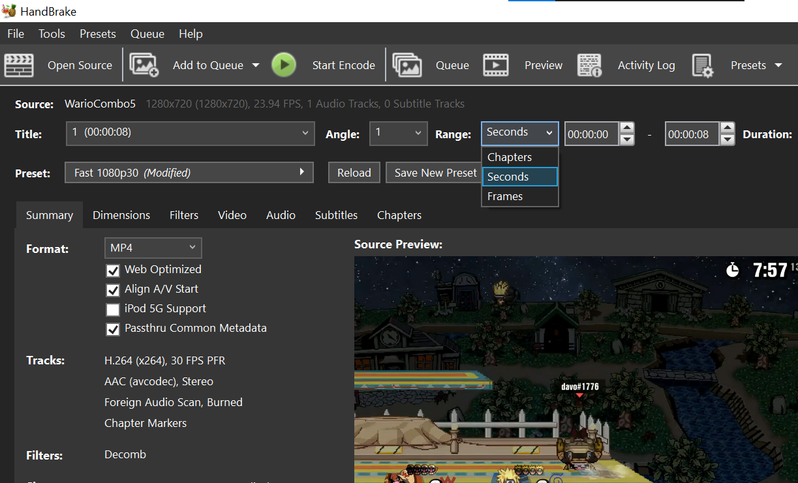
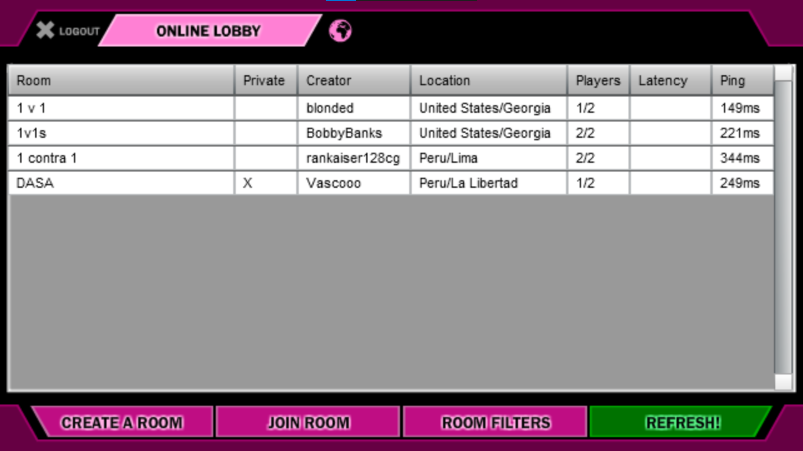
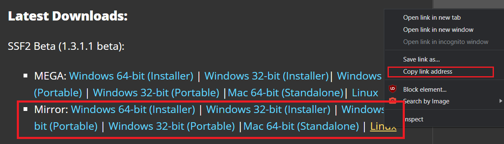
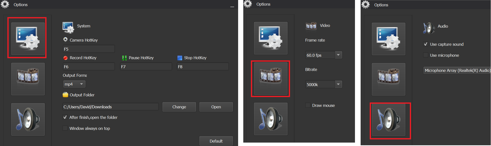
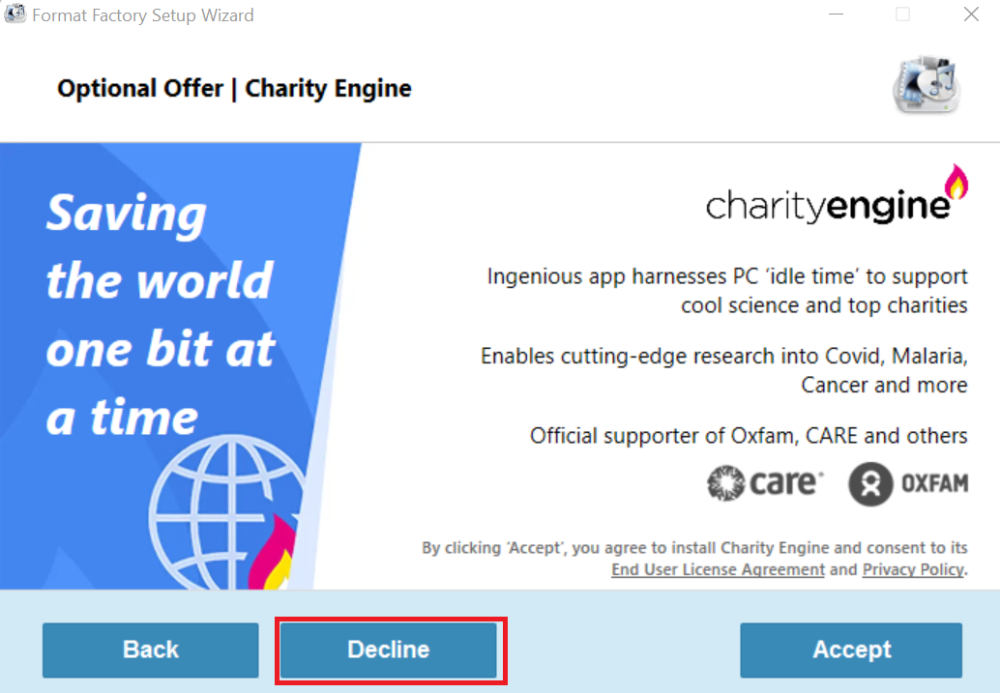
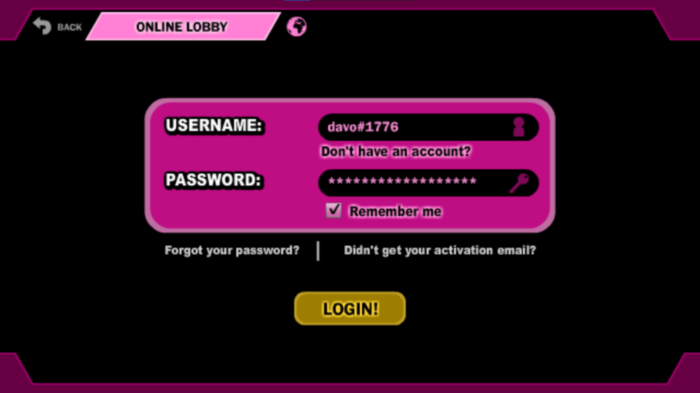
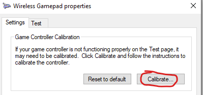
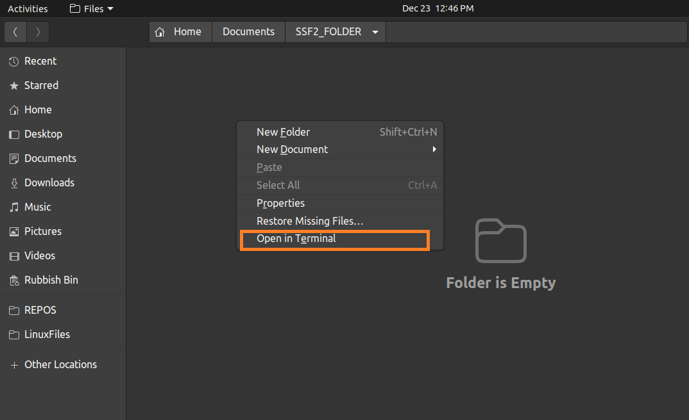
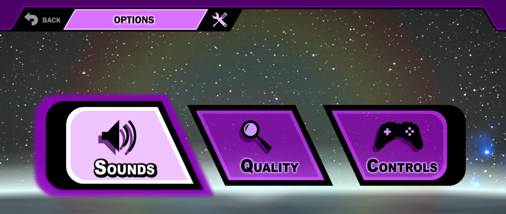

# **3\. Online Play** {#3.-online-play}

---

## 3.1 How to Verse People {#3.1-how-to-verse-people}

---

1. Create a [McLeodGaming Network](https://mgn.mcleodgaming.com/) (MGN) account at [this site](https://mgn.mcleodgaming.com/account/register).  
   * You may use this [same site](https://mgn.mcleodgaming.com/) to change your account name/email/location in the future.  
   * If you have issues registering your account, please see the [registration issues section](#3.7.1-online-registration-errors).  
2. Start SSF2 on your PC, get to the Main Menu, and select “**Online**”.  
   *   
   * **Note:** To play locally (offline), select the “Group” option.  
3. At the **Online Lobby** screen, log in with the same details you use on the [MGN site](https://mgn.mcleodgaming.com/).   
   *   
4. Once signed in, you will see the “lobby”, where each row is a different “room”.  
   *   
5. One person, called the “host”, will make a room by pressing “Create A Room”.  
   * Below is how the room creation window looks like.   
   *   
   * The room name can be almost anything more than 4 letters.  
   * The password can be anything, but keep it short for your opponent’s convenience.  
   * The latency setting should always be on Auto. There is no need to change this.  
   * The **input delay** should:  
     * Be set to Low for people who are close (same country or region) and have a [good connection](#3.4-checking-internet). This will provide more responsive controls, but will cause lag spikes if the connection is not good enough.

     * Be set to Normal for people who are a bit further away (neighbouring region), have medium level internet, or people who you had lag spikes with on the “Low” setting.

     * Be set to High when even Normal is lag spiking, but this is not ideal and it is rarely used. 

     * Never be set to Auto\! This will cause the input delay to change constantly, making it near impossible to time your inputs correctly.  
6. The other person simply has to join the room with the “Join Room” button.  
7. From there, follow the prompts (e.g. press space bar when you’ve chosen your character).

## 

## ---

## **3.2** **Improving Your Online Experience** {#3.2-improving-your-online-experience}

---

* Ensure your graphics settings are set to ‘minimum’ to reduce [lag](https://mcleodgaming.fandom.com/wiki/Lag#Wi-Fi_lag).  
  * See the [Graphics Settings section](#2.3.2-quality/graphics-settings) for more details.  
* Find opponents closer to you on [Discord](https://discord.com/), since distance is a massive factor in online lag.  
  * I highly recommending checking the [Discord Communities section](#3.3-discord-communities).  
* Ideally, both you and your opponent should have “[good internet](#3.4-checking-internet)” and a “[good type of connection](#3.5-types-of-connections)”. Please see the relevant sections.  
* Each time before you play, close as many other programs as you can.  
* Every time you verse a different opponent, restart your SSF2 program. Otherwise, it is quite likely you will get the [“P2P Connection Failed” warning message](#3.8-peer-to-peer-\(p2p\)-connection-failed).  
* Use the right input delay when hosting your room. See this [bookmark](#bookmark=id.42v5s7bap6kd%20).  
* I do not recommend “versing randoms” and expecting a good online experience. This is when you join random rooms OR you create a room with no password and let random users join. This is not recommended as these opponents may be very far from you and/or may not have configured their SSF2 properly (e.g. haven’t turned their [graphics settings](#2.3.2-quality/graphics-settings) down). 

## ---

## **3.3** **Discord Communities** {#3.3-discord-communities}

---

[Discord](https://discord.com/) is where the SSF2 community is most active.

There are many SSF2 [“region servers”](https://www.reddit.com/r/SuperSmashFlash/comments/sto6r6/ssf2_region_servers/) which are extremely useful for finding less laggy SSF2 matches regularly and easily, and they can help you feel a sense of belonging. 

Note that they are based on your **region of *residence*** and not *origin*.

See the table below to find your community/server:

| Region of Residence | Discord Server(s) |
| :---- | :---- |
| [North America](https://en.wikipedia.org/wiki/List_of_North_American_countries_by_population)  | The [McLeod Gaming server](https://discord.com/invite/mcleodgaming) (AKA “the main/official server”) The [SMASH FLASH BAY](https://discord.gg/RcDEVACJgC) server (the new FFC) |
| [South America](https://en.wikipedia.org/wiki/List_of_South_American_countries_by_population) | [SSF2 Beyond (Latam Server)](https://discord.gg/76NTu4rA98)  [SSF2 Brazil](https://discord.com/invite/gCVveAQ9jt) |
| [Europe](https://en.wikipedia.org/wiki/List_of_European_countries_by_population) | [FrayFlash EUnion](https://discord.com/invite/m4W8ZyHSES) (For SSF2 AND Fraymakers) [SSF2 Europe](https://discord.com/invite/4PqGwHrSGd) [SSF2 France](https://discord.com/invite/SNdTYkpvKK) |
| [Oceania](https://en.wikipedia.org/wiki/List_of_Oceanian_countries_by_population) (Australia, New Zealand, etc.) | [Australia/New Zealand (ANZ) SSF2 Hangout](https://discord.com/invite/t8xKcMBNVj) |
| [Asia region](https://en.wikipedia.org/wiki/List_of_Asian_countries_by_population) (includes [most of the Middle East](https://en.wikipedia.org/wiki/West_Asia)) | [Asian SSF2 Network](https://discord.com/invite/MRsyNUdM4S) |
| [Africa region](https://en.wikipedia.org/wiki/List_of_African_countries_by_population) | [African SSF2 Community](https://discord.com/invite/6VmSMyfccZ) |

---

## 3.4 Checking Internet {#3.4-checking-internet}

---

|  | Do not use the ping numbers in the lobby (“lobby ping”) as a measure of good internet\! These numbers are actually the ping to the [MGN](https://mgn.mcleodgaming.com/) servers, not to your opponent.  They do not matter much\! |
| :---- | :---- |

A better test that is used widely in the community, and in tournaments, is an “[Ookla Speedtest](https://www.speedtest.net/)”. Simply visit the [official Ookla site](https://www.speedtest.net/) and press “Go”, and wait, to get your results. To improve your Ookla results, having a [good type of connection](#3.5-types-of-connections) can help.

The lag clause in the [Alliance Universal ruleset](https://www.whensflash.cx/#ruleset), used for major competitive tournaments, states:

* *…Ookla Speedtest is recommended…*  
* *…the bare minimum playing requirements \[are a\]...*  
  * *Ping of **35** or lower.*  
  * *Download speed of **15 Mb/s** or higher.*  
  * *Upload speed of **5 Mb/s** or higher.*

My personal advice:

* Your “**Ookla ping**” is what matters the most. If your Ookla ping is 15ms or lower, you should be fine. The lower ping the better.  
* The upload and download speeds are nowhere near as relevant as your ping. Anything above a fairly low threshold of 5 Mbps is fairly decent. This is because SSF2 online does not involve much data transfer. It is only transferring key input data, not videos or images. Hence, the speed of transfer (ping) is *far more important* than the data transfer capacity (download/upload speed).  
* Here is an Ookla speed test result for a below average ethernet connection.   
  *   
  * I played on this connection with other fellow Australians hundreds of times and the connection was decent, with fairly low lag.  
  * This demonstrates that, with ethernet, nearby players and a decent connection, you can have a good online experience.

---

## 3.5 Types of Connections {#3.5-types-of-connections}

---

A **Wired/LAN/Ethernet** connection is the **best** type of connection for SSF2. Try to use an Ethernet cable if you can. 

* Using Ethernet generally lowers ping, improves stability and reduces interference.   
* If you don’t have an Ethernet port, get a cheap [USB to Ethernet adapter](https://www.ebay.com/sch/i.html?_&_nkw=USB+to+Ethernet+adapter+-USB-C).  
* If you are too far from your modem for Ethernet, a [Powerline Adapter](https://www.tp-link.com/au/powerline/#what-is-powerline) is a great investment.  
  * This device allows you to get Ethernet at **every powerpoint/room** (by using the wiring inside the walls as ethernet cables).   
  * No drilling is required, and it only takes a few minutes to set up.   
  * Here are [more details](https://www.tp-link.com/au/powerline/#what-is-powerline) on what they are and how they work, and here is a [cheap model](https://netplus.com.au/products/tp-link-tl-pa4010kit-av600-powerline-ethernet-adapter-starter-kit-600mbps-homeplug-av-1xlan-port-300m-range-plug-play-mini-size?_pos=2&_sid=6a9f97376&_ss=r) that I recommend.

A **Wireless/Wi-Fi** connection is the next best type of connection. If you must use this, ensure you are close enough to the modem, and try to reduce interference (e.g. from microwaves).

Other types of connections will likely cause [lag](https://mcleodgaming.fandom.com/wiki/Lag#Wi-Fi_lag) and issues:

* Cellular/Mobile Data (e.g. 2G/3G/4G), and Hotspots.  
* Satellite Internet.  
* etc.

---

 

## 3.6 Parsec {#3.6-parsec}

---

**Resources:**  
The best Parsec resource I’ve seen is [this awesome guide from Tichampi](https://docs.google.com/document/d/10PKOs70SLbQOQsR2TWbx7UX9_Lf_97KiKlnGcX_7_l4/edit)\!

Here is the the [official Parsec site](https://parsec.app/) and a [general guide](https://www.alphr.com/how-to-play-with-friends-in-parsec/).

**Info:**

Using Parsec is a completely different method of playing SSF2 online. Basically, you give the opponent access to the game running on your PC. It is a bit like **TeamViewer/Remote Desktop** but you can limit access to just the game and it is optimised for low latency gaming. It is like your opponent is **on the same keyboard as you**. There is some chance it may be faster than using regular online for a given pair of players.

Beware, it relies on video streaming, and so has **higher internet demands** in terms of download and upload speed, in comparison to regular online. It may also require both players to have decent graphics cards that can encode/decode the video frames quickly.

The regular SSF2 online is used more by the community and personally, I only use the regular online. This is because in most cases, the game is fine for the “host” but very **jumpy/stuttery** for the opponent.

---

## 3.7 Online Errors {#3.7-online-errors}

---

### **3.7.1 Online Registration Errors** {#3.7.1-online-registration-errors}

If you get the “*Error signing up with the provided username and email. Please try again.*” error,   
it may be due to:

1. A typo in your email. Check you have the “**@**” symbol and a “**.com**” ending  
2. The username or email you entered being in use already.   
   * You can check whether either has been used already via the [Forgot Password](https://mgn.mcleodgaming.com/account/forgotpass) feature.  
   * If it does find the account, then the username or email is in use.

You can also try:

* Using incognito mode.  
* Using a different browser (e.g. [Firefox](https://www.mozilla.org/en-US/firefox/new/), [Edge](https://www.microsoft.com/en-us/edge)).  
* Using your phone.

### 

### ---

### **3.7.2 Error Code Meanings** {#3.7.2-error-code-meanings}

These are the official meanings of the SSF2 online errors that are found using the “\!mgnerrors“ command in the [official McLeod Gaming server](https://discord.com/invite/mcleodgaming).

***000** \- An unknown error was produced that crashed the error handler \- please report what you were doing to a Bug Reporter\!*

***001** \- Unknown error \- please report what you were doing to a Bug Reporter\!*

***002** \- You seem to not have an entry in the online lobby, preventing the match from starting (Did you lose internet temporarily?)*

***003** \- The online lobby appears to not enough players in the room to start the match (Did you or an opponent disconnect in the middle of the match starting?)*

***004** \- Usernames were mixed up or missing in the online lobby (Did someone disconnect, or change their username on the MGN website in the middle of being in your lobby? Otherwise, could be a game bug, please report what you were doing to a Bug Reporter.)*

***005** \- P2P connection ID did not match the expected result (Looks like a game bug, please report what you were doing to a Bug Reporter.)*

***006** \- The game failed to prepare the first frame controls to send to the opponent. (Looks like a game bug, please report what you were doing to a Bug Reporter.)*

***007** \- The game got frames 2 and 3 of controls data when trying to start the game, but was unable to get frame 1 due to a connection failure. Please try again.*

***008** \- The game got frames 1 and 3 of controls data when trying to start the game, but was unable to get frame 2 due to a connection failure. Please try again.*

***009** \- The connection between you and your opponent(s) is impossible (Try resetting the game, but if that doesn't solve the problem, typically this is caused by firewalls or internet security that you or the others have. We will not be able to help you fix this as it is not an issue with the game.)*

---

### **3.7.3 Error Code Troubleshooting** {#3.7.3-error-code-troubleshooting}

Note that Error **009** and **004** are often linked. If one person sees 009, it's common for the other person to see 004\.

If you get any error code, both players should:

* **Restart** SSF2 (close and re-open the game).  
* Switch **hosts** (i.e. Try letting the other person make the room).  
* Let SSF2 through their **firewall** \- use this [guide](https://www.computerhope.com/issues/ch001324.htm). This can help with Error **009**.  
* Reset their **network stack** \- use this [guide](https://kb.wisc.edu/dermatology/page.php?id=31480) or this [Powershell script](https://github.com/DavoDC/WindowsFiles/tree/main/Scripts/PowerShell/Internet_Fixer) I wrote.

If the issue persists, you may just be incompatible with your opponent, or too far away from them.

See the [Improving Your Online Experience](#3.2-improving-your-online-experience) section.

---

## 3.8 Peer to Peer (P2P) Connection Failed {#3.8-peer-to-peer-(p2p)-connection-failed}

---

While connecting to your opponent in the [Waiting Room](https://mcleodgaming.fandom.com/wiki/Waiting_Room), you may get this warning message: “*P2P Connection failed. Falling back to server-to-server communication…*”, which looks like:

This means that SSF2 ***could not*** successfully establish a **Peer-to-Peer (P2P)** connection, which can occur due to:

- Firewalls and other internet security measures.  
  * See [this guide](https://www.computerhope.com/issues/ch001324.htm) to let SSF2 through your PC’s firewall.  
- Network configuration and devices (e.g. modems).  
- Internet Service Providers (ISPs), etc.  
- The connection involving more of the above due to excessive distance between players.  
  * Which I why I recommend versing [nearby players](#3.3-discord-communities).

The exact cause is often difficult to determine, but the advice in this guide is still valid.

This warning message is **not desirable**, as explained below.

| ✅🙂?? | By default, SSF2 will attempt a P2P connection, which involves two computers connecting to each other directly. A successful P2P connection is optimal, since it reduces latency by enabling direct communication between peers 🙂.  It often requires both peers/players letting SSF2 through their firewall (See this [guide](https://www.computerhope.com/issues/ch001324.htm)). |
| :---- | :---- |
| ❌☹️?? | If establishing the **P2P connection fails** (i.e. you receive the warning message), SSF2 will then **fallback** to a **client-server connection**, resulting in **lag** ☹️. The [MGN server](https://mgn.mcleodgaming.com/) (in the [USA](https://en.wikipedia.org/wiki/United_States)) acts as an **intermediary**, adding extra steps for data transmission, resulting in higher latency compared to direct **P2P** communication where data travels more directly between nodes. Additionally, client-server architectures introduce potential bottlenecks and delays as all client requests need to be processed by the central server. |

**Note:** Some players use **VPNs** to attempt to reduce lag by "getting closer" to other players. However, this often backfires, as the VPN acts as a middle-man, essentially *preventing* optimal **P2P** connections and forcing the client-server situation to occur, leading to worsened performance.

---
