# **4\. Replays** {#4.-replays}

---

## 4.1 Storage Scenarios {#4.1-storage-scenarios}

---

SSF2 stores replays in **two** scenarios.

The **first** scenario is when the “Save Replay” button is used after a match in the results screen. 

* 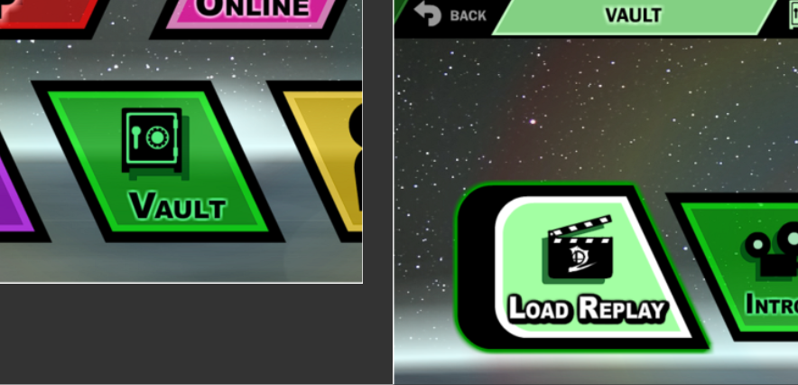

The **second** scenario is when “**Autosave Replays**” is enabled in the “Data” menu (see below) and the results screen has been passed. 

* 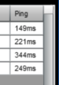  
* If you close the game during the results screen, the autosave may not apply. So be sure to proceed to the character select screen, or beyond.  
* See the [next section](#4.2-finding-autosaved-replays) for how to find the autosaved replays.  
* With this setting on, you will accumulate many replays, but they are extremely small and so won’t affect your PC much at all. You can look at [my collection of replays](https://github.com/DavoDC/SSF2Replays) to see how small they are.  
* Regarding the **Replay Autosave** feature:  
  * It is available on all versions except the Native Linux version.  
  * The feature was added to SSF2 in version 1.3.0.0 ([See article here](https://www.supersmashflash.com/2020/12/ssf2-v1-3-released/))  
  * It has a minor bug where the date on the replays is one day ahead. See the section below for how you can fix this.

---

### **4.1.1 Fixing the Replay Autosave Date Bug** {#4.1.1-fixing-the-replay-autosave-date-bug}

Have you noticed that the date on autosaved replays is one day ahead in the future compared to when you actually played? I've figured out how to fix that 🙂

Check out this Reddit post: [Fixing the Replay Autosave Date Day Glitch/Error : r/SuperSmashFlash](https://www.reddit.com/r/SuperSmashFlash/comments/t3z28b/fixing_the_replay_autosave_date_day_glitcherror/).

---

## 4.2 Finding Autosaved Replays {#4.2-finding-autosaved-replays}

---

### **4.2.1 Windows** {#4.2.1-windows}

Here is a fast way to find replays on Windows that generally always works:

1. Press the Windows key and R (Should [look like the image below](https://drive.google.com/file/d/15asbzrF_-IEAt7VxpxK-2SnuO-axi4EB/view)).  
2. Paste in "C:\\Users\\\\%username%\\\\SSF2Replays"  (with or without quotes) (uses environment variable)  
3. Press OK/Enter.  
4. Now you may make a shortcut or a [Quick Access shortcut](https://www.windowscentral.com/how-use-quick-access-file-explorer-windows-10) to your autosaved replays. 

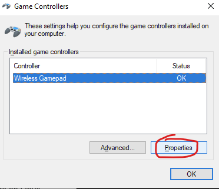

---

### **4.2.2 Mac** {#4.2.2-mac}

The location of your autosaved replays will be something like:

Mac SSD \> Users \> **\<username\>** \> SSF2Replays

If you need help finding your user folder, see [this article](https://qr.ae/pG6KYB).

---

### **4.2.3 Linux** {#4.2.3-linux}

For the Wine Linux version (Installer and Portable), the replay folder path will be something like:

/home/david/.wine/drive\_c/users/david/SSF2Replays

For the Native Linux version, there is no replay autosave option in the Data menu.

---

## 4.3 Converting Replays to Video {#4.3-converting-replays-to-video}

---

### **4.3.1 Overview** {#4.3.1-overview}

---

SSF2 stores replays in the “**.ssfrec**” format. The majority of the data is just the key inputs used during the game, so conversion to video cannot occur directly. The game’s events must be “recreated” and recorded, using the game and screen record software. See the [next section](#4.3.2-screen-record-software-options) for software options.

### ---

### **4.3.2 Screen Record Software Options** {#4.3.2-screen-record-software-options}

### ---

I personally use [Format Factory](http://www.pcfreetime.com/formatfactory/index.php?language=en)’s Screen Recorder, for its simplicity and reliability.

* See the [next section](#4.3.3-using-format-factory’s-screen-recorder) for a detailed guide on using Format Factory’s Screen Recorder. 

[OBS (Open Broadcaster Software)](https://obsproject.com/) is commonly used, and works on all operating systems.

* There are many [YouTube guides](https://www.youtube.com/results?search_query=record+game+clips+obs) available.  
* It can be slow or nonfunctional sometimes, so try the other options here in that case.

If you are using **Windows**:

* [Windows/Xbox Game Bar](https://support.xbox.com/en-AU/help/games-apps/game-setup-and-play/get-to-know-game-bar-on-windows-10) is often used. Here is a [guide link](https://au.pcmag.com/how-to/44814/how-to-capture-video-clips-in-windows-10).  
  * Although it has a common issue where it only records within the top left corner with a black border  
* Here are some [Windows screen recorder software alternatives](https://alternativeto.net/software/open-broadcaster-software/?platform=windows).

If you are using **Linux**:

* I recommend Kazam. Here is [a guide on how to use Kazam on Linux](https://itsfoss.com/kazam-screen-recorder/).  
  * This is what I used to record the [SSF2 on Linux video](https://youtu.be/vHMe8zDKM9A) 😉.  
* Here are some [Linux screen recorder software alternatives](https://alternativeto.net/browse/search/?q=screen%20recorder%20linux).

Here is some advice from the pins of the [\#ssf2-replays](https://discord.com/channels/271284605531717632/356244432791797760) channel of the [official McLeod Gaming server](https://discord.com/invite/mcleodgaming):

* **Screen Recorders (Completely free, no watermarks, rated out of 10\)**  
  * UPDATED: May 30, 2019  
  * Just note that all of these screen recorders are great. None of them are terrible. It's just that some are better than others, but if one doesn't work, there's three other options.  
* **OBS (Open Broadcaster Software):**  
  * You can record multiple "capture windows" at once, allowing for overlays, like a keyboard input display.  
  * **Visual Quality:** 10  
  * **Audio Quality:** 9  
  * **Video Smoothness (FPS Dependent):** 9  
  * **Ease of Use:** 7  
  * **Ease of Use (Initial Setup):** 6  
  * **Flexibility (What settings you can change):** 10  
* **Windows 10 DVR (Xbox Game Bar)**  
  * This is built into Windows 10\. Just press Windows Key+G.  
  * **Visual Quality:** 9  
  * **Audio Quality:** 4  
  * **Video Smoothness (FPS Dependent):** 8  
  * **Ease of Use:** 9  
  * **Ease of Use (Initial Setup):** 10  
  * **Flexibility (What settings you can change):** 4  
* **Nvidia Shadowplay**  
  * You must have a compatible graphics card installed in order to use Shadowplay. If you do, make sure you have GeForce Experience installed and you have the in-game overlay turned on. Just ALT+Z to bring up the overlay. Compatible GPUs are in the table in [this link](https://www.geforce.com/geforce-experience/system-requirements), under "Share and SHIELD PC Streaming."  
  * **Visual Quality:** 10  
  * **Audio Quality:** 9  
  * **Video Smoothness (FPS Dependent):** 9  
  * **Ease of Use:** 9  
  * **Ease of Use (Initial Setup):** 8  
  * **Flexibility (What settings you can change):** 4  
* **ShareX**  
  * The Swiss Army Knife of screen capturing tools, as it can do *a lot of things*. It even has a colour picker, a screen tester, a ruler, and much more.  
  * **Visual Quality:** 10  
  * **Audio Quality:** 9  
  * **Video Smoothness (FPS Dependent):** 3  
  * **Ease of Use:** 8  
  * **Ease of Use (Initial Setup):** 8  
  * **Flexibility (What settings you can change):** 10

---

### **4.3.3 Using Format Factory’s Screen Recorder** {#4.3.3-using-format-factory’s-screen-recorder}

---

1. Download Format Factory by visiting the [official download site](http://www.pcfreetime.com/formatfactory/index.php?language=en)  
   1. Press the Download button as shown below  
   2.   
   3. As you can see, FormatFactory can do many other useful things as well, like convert between a very wide range of file formats (e.g. MP4 to MP3).

      

2. Install Format Factory by running the downloaded installer  
   * 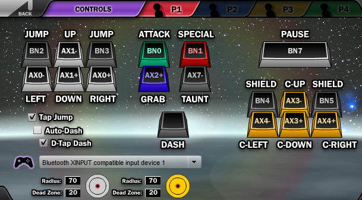  
   * There are some adverts in the installer for other software (See below).  
   * But you can just decline these, or remove them after if you accidentally accepted them.  
   * 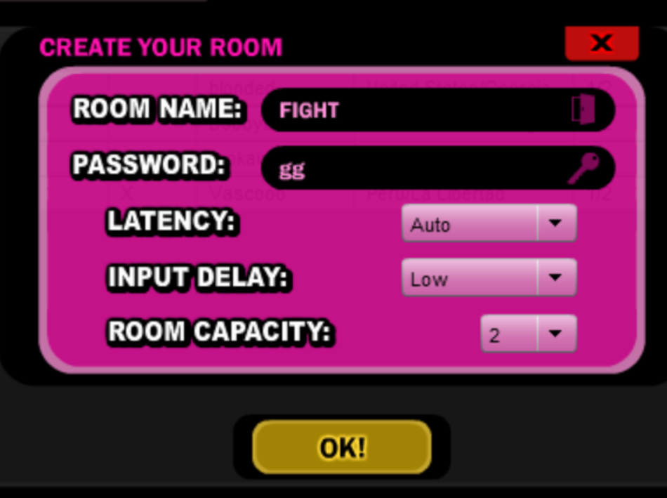

2. Open Format Factory’s Screen Recorder  
   * Search “Screen Record” in Windows and open the result:  
     * 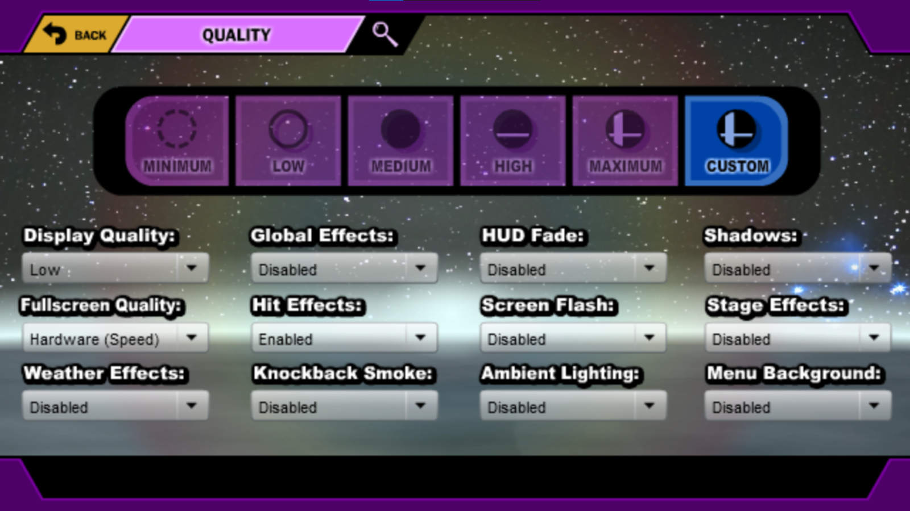  
   * Alternatively, you can open Format Factory and select Screen Record in the Video menu, as shown [here](https://www.youtube.com/watch?v=y0VqVZuFQRA).  
   * You should now see the Screen Recorder menu.   
   * 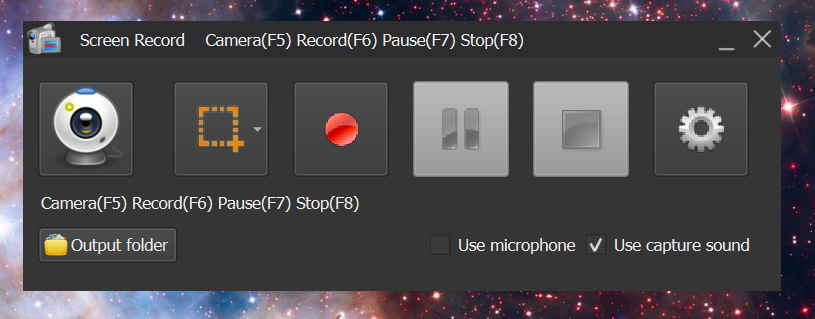  
   * Click the Settings gear and adjust your settings.   
     * I recommend something like:  
     * 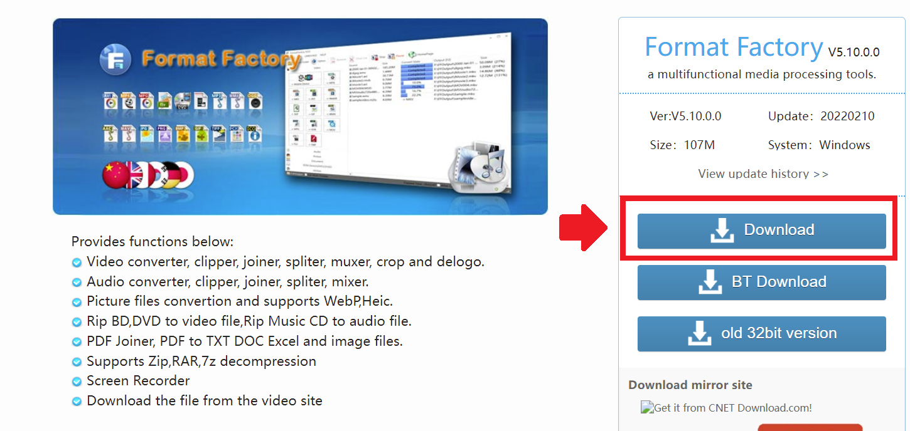  
     * Be sure to press Ok on each of the three settings tabs to save your settings

3. Prepare your computer/settings/game  
   * Put the replay in a place that is easy to find so you can find it fast.  
     * e.g. A folder on Quick Access  
   * Close Discord or any other programs that may make recordable noise.  
   * Turn up your in-game graphics setting temporarily so the replay looks better (if your PC can handle this and still run the game at full speed).  
   * Turn up your music and sound in-game a bit if you want it in the recording  
   * Ensure your Windows volume setting is high enough if you want audio.  
     * If your Windows Volume is low, the video’s volume will be low.

4. Start recording your screen  
   * Select the square lasso icon, then ‘Window’, then click the SSF2 window. A red outline of the whole window should be shown.  
   * 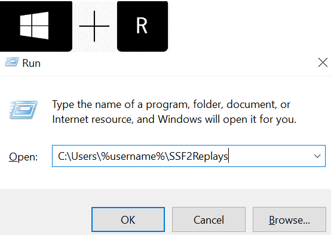  
   * Click the red button to start the recording.  
   * The Screen Recorder menu will shift to the background, out of sight.

     

5. Load the replay into SSF2 via the “Vault” menu.  
   * 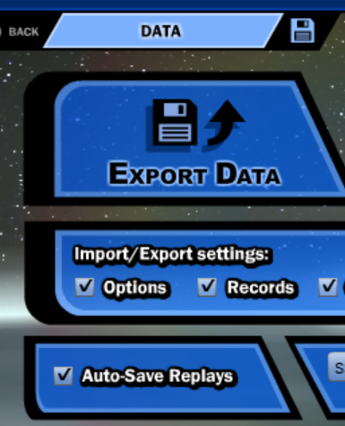

     

6. Let the screen recorder capture the replay undisturbed.  
   * Let the replay go from start to finish, with nothing appearing on the window.  
   * Do not change your volume/brightness, as the overlay will be recorded.

7. Stop the screen recording by changing tabs to the Screen Recorder and clicking Stop.  
   * Wait for the program to process the video and save it. Do not close it prematurely.

8. Find the video in its saved location.  
   * The folder should open automatically.  
   * If it doesn’t, just check the settings for the folder path.

   

9. Trim out the start (and possibly finish) with a video trimmer program.  
   * You will need to trim the start of the video where you are selecting the replay, and possibly the end if you let the results screen record for a long time.   
   * I recommend [HandBrake](https://handbrake.fr/) for its simplicity and customizability.  
   * Once installed, open the video with it.  
   * In the “Range” option, click the dropdown, select “Seconds”, and enter your start and finish times.  
   * I recommend the Fast1080p30 preset and the Web Optimised setting.  
   * 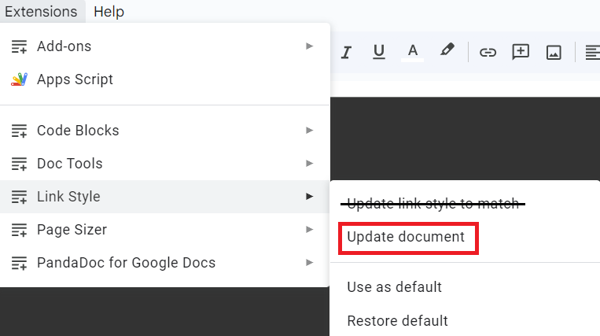

10. Combine videos if desired. You may want to join several replays together.  
    * You can use the [Video Joiner](https://youtu.be/bY_oe7Q78fI) packaged with Format Factory.  
    * If you installed Format Factory before, you will have this.  
    * You may also use [MP4Joiner](https://www.mp4joiner.org/en/).

11. Distribute your replay video.

    * For a long clip, upload it to [YouTube](https://www.youtube.com/).

    * For a medium-length clip, use a stream hosting service like [Streamable](https://streamable.com/).

    * For a short clip, upload directly to Discord.

      * Ensure the file format is “.mp4” so the preview shows up  
      * If the video is over the 8MB limit, use this [online compressor](https://8mb.video/).

---
