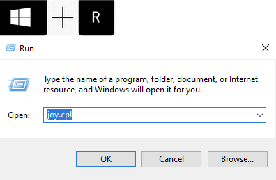
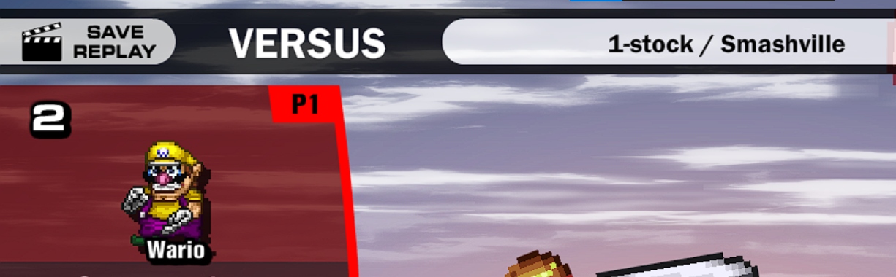

# **7\. Remarks** {#7.-remarks}

---

This guide was created by **davo1776** with the following aims:

* Help new players get started with the game quickly.  
* Help players have a better experience with SSF2.  
* Centralise information about SSF2.  
* Answer common queries and solve common problems.  
* Dispel common misconceptions.  
* Provide new players with the “common knowledge” that long-time players have.  
* Assist with the helping of players with various issues in the official server.

  * Many parts of this guide were based on common questions asked there.

* Ultimately help the game, community, and developers.

Thank you to:

* **PsnDth\#0399** for his feedback and advice, for pinning the guide in \#ssf2 in official.  
* **CraftGMC** for helping players and directing them to various sections of the guide.  
* **Tekacity** for the flatpak guide and the Chromebook information/process.  
* **Bird\_Brain\#2965** for pinning the guide in \#resources-2 in FFC.  
* **binyo\#7964 f**or pinning the guide in \#resources in FFC.  
* **Jimmy'sMom\#3279** for the Controller information.  
* **Heatnova V. Basic\#0049** for the Mac information.  
* **JustSomeGuy\#2295** for his feedback and advice.  
* Everyone else who supported and encouraged me 🙂.

**Notes to self/authors:**

* To standardise the formatting of links, use Extensions \-\> Link Style \-\> Update document.

  * 

  * This will replace the hard-to-see dark blue links with the lighter blue links.

* To sort the terminology table alphabetically:

  * Select the whole table.

  * Use Extensions \-\> Doc Tools \-\> Sort the selection ascending.

* The document uses a spacing of **1.5**.

  * 

  * Beware when the table of contents is updated, this needs to be re-applied.

* Use heading links instead of bookmarks where possible.

  * 

  * In the link creation dialog, search and select one of the “Tt” options.

**END OF GUIDE**
