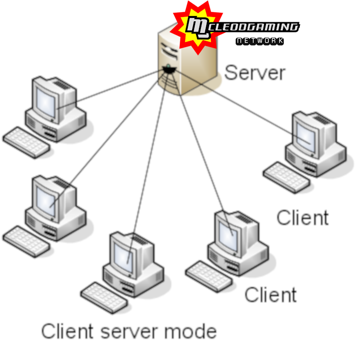

# SSF2 Player Guide

**Google Drive source (source of truth):** https://docs.google.com/document/d/1l5VrAaWmLozu9qnwdjz6MGA9GyurlkgNF8t72eZ4-54

This is a GitHub-hosted clone split into sections. See [README.md](README.md).

---

# 

# SSF2 Player Guide

## **Author:** davo1776 *Direct message or ping me on Discord for any suggestions or comments.*

## ---

## **Table of Contents**

---

Each section is hyperlinked below to assist you in navigating the guide.

[1\. Setup](#1.-setup)

[1.1 Installation](#1.1-installation)

[1.1.1 Windows](#1.1.1-windows)

[1.1.1.1 Windows Troubleshooting](#1.1.1.1-windows-troubleshooting)

[1.1.2 Mac](#1.1.2-mac)

[1.1.2.1 Mac Troubleshooting](#1.1.2.1-mac-troubleshooting)

[1.1.3 Linux](#1.1.3-linux)

[Important Note](#important-note)

[1.1.3.1 Choosing Between the Native and Wine Versions](#1.1.3.1-choosing-between-the-native-and-wine-versions)

[1.1.3.2 Native Linux Installation](#1.1.3.2-native-linux-installation)

[1.1.3.3 Wine Linux Installation](#1.1.3.3-wine-linux-installation)

[1.1.3.4 Chromebook Linux Installation](#1.1.3.4-chromebook-linux-installation)

[1.1.3.5 Flatpak Linux Installation](#1.1.3.5-flatpak-linux-installation)

[1.1.3.6 Linux Troubleshooting](#1.1.3.6-linux-troubleshooting)

[1.2 Download](#1.2-download)

[1.2.1 Simple Download](#1.2.1-simple-download)

[1.2.2 Terminal Download](#1.2.2-terminal-download)

[1.3 Updating](#1.3-updating)

[2\. Configuration](#2.-configuration)

[2.1 Keyboard](#2.1-keyboard)

[2.2 Controllers](#2.2-controllers)

[2.2.1 Controllers on Linux](#2.2.1-controllers-on-linux)

[2.2.2 Controllers on Windows](#2.2.2-controllers-on-windows)

[2.2.3 Controller Advice](#2.2.3-controller-advice)

[2.3 Settings/Options](#2.3-settings/options)

[2.3.1 Sounds Settings](#2.3.1-sounds-settings)

[2.3.2 Quality/Graphics Settings](#2.3.2-quality/graphics-settings)

[2.3.3 Controls Settings](#2.3.3-controls-settings)

[3\. Online Play](#3.-online-play)

[3.1 How to Verse People](#3.1-how-to-verse-people)

[3.2 Improving Your Online Experience](#3.2-improving-your-online-experience)

[3.3 Discord Communities](#3.3-discord-communities)

[3.4 Checking Internet](#3.4-checking-internet)

[3.5 Types of Connections](#3.5-types-of-connections)

[3.6 Parsec](#3.6-parsec)

[3.7 Online Errors](#3.7-online-errors)

[3.7.1 Online Registration Errors](#3.7.1-online-registration-errors)

[3.7.2 Error Code Meanings](#3.7.2-error-code-meanings)

[3.7.3 Error Code Troubleshooting](#3.7.3-error-code-troubleshooting)

[3.8 Peer to Peer (P2P) Connection Failed](#3.8-peer-to-peer-\(p2p\)-connection-failed)

[4\. Replays](#4.-replays)

[4.1 Storage Scenarios](#4.1-storage-scenarios)

[4.1.1 Fixing the Replay Autosave Date Bug](#4.1.1-fixing-the-replay-autosave-date-bug)

[4.2 Finding Autosaved Replays](#4.2-finding-autosaved-replays)

[4.2.1 Windows](#4.2.1-windows)

[4.2.2 Mac](#4.2.2-mac)

[4.2.3 Linux](#4.2.3-linux)

[4.3 Converting Replays to Video](#4.3-converting-replays-to-video)

[4.3.1 Overview](#4.3.1-overview)

[4.3.2 Screen Record Software Options](#4.3.2-screen-record-software-options)

[4.3.3 Using Format Factory’s Screen Recorder](#4.3.3-using-format-factory’s-screen-recorder)

[5\. Resources](#5.-resources)

[5.1 General Resources](#5.1-general-resources)

[5.2 Competitive Resources](#5.2-competitive-resources)

[5.3 Character-Specific Resources](#5.3-character-specific-resources)

[6\. Terminology](#6.-terminology)

[7\. Remarks](#7.-remarks)

---
